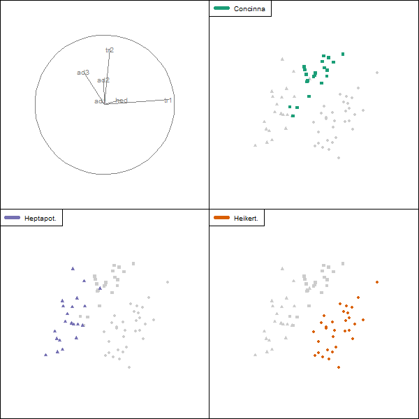
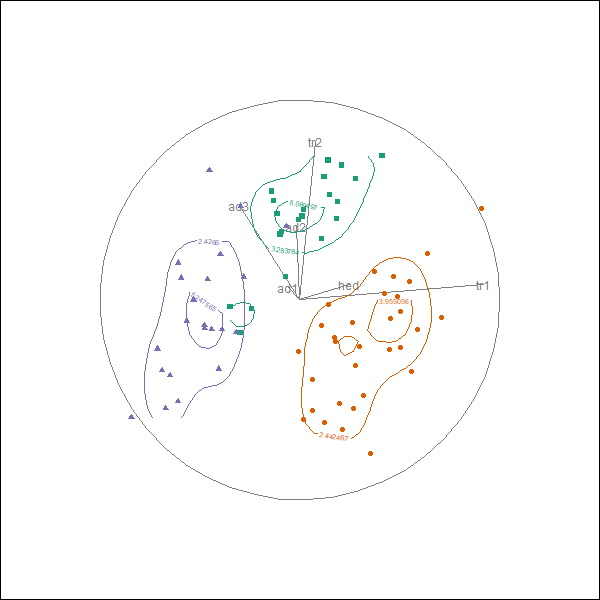

```{r setup, include=FALSE}
knitr::opts_chunk$set(
  echo       = FALSE,  #code
  include    = TRUE,   #plots
  results    = "hide", #text 'markup' 'asis' 'hold' 'hide' 
  message    = FALSE,  #messages
  warning    = FALSE,  #warnings
  error      = FALSE,  #errors
  collapse   = TRUE,
  #comment    = "",
  #fig.height = 8,
  #fig.width  = 12,
  #fig.align  = "center",
  fig.show = "hold",
  strip.white = TRUE,
  cache      = FALSE
)

#devtools::install_github("nspyrison/spinifex")
library(spinifex) #interferes with ggplot2?! load before ggplot2
library(knitr)
library(tourr)
library(Rtsne)
library(tibble)
library(ggplot2)
library(ggthemes)
library(magrittr)
library(gridExtra)
library(flexdashboard)
```

```{r code for method compare}
flea_std <- tourr::rescale(flea[, 1:6])
### PCA -----
f.pca <- stats::prcomp(flea_std, center = TRUE, scale. = TRUE)
dat <- as.data.frame(tourr::rescale(f.pca$x))
dat <- as.data.frame(cbind(dat, as.factor(flea[,7])))
colnames(dat) <- c(paste0("PC", 1:6), "Species")

gg3 <- ggplot(dat, aes(x = PC1, y = PC2, shape = Species, col = Species)) +
  geom_point(size = 2) + ggtitle("PCA") + coord_fixed() +
  xlab("First Component") + ylab("Second Component") +
  theme_minimal() + theme(legend.position = c(0, 0),
                       legend.background=element_rect(colour ="darkgray") ) +
  theme(axis.text.x=element_blank(), axis.text.y=element_blank()) +
  scale_color_brewer(palette = "Dark2") 

### PCA pdf, cdf -----
dat <- as.data.frame(
  rbind(c(0,0,0,0), 
    cbind("PC" = 1:6,
      "Var" = f.pca$sdev, 
      "Prop_Var" = f.pca$sdev/sum(f.pca$sdev),
      "cumsum_Prop_Var" = cumsum(f.pca$sdev)/sum(f.pca$sdev)
    )
  )
)
gg1 <- ggplot(dat[-1, ], aes(x=PC, y=Prop_Var, label=round(Prop_Var, 2))) +
  geom_point(size=1) + geom_line() + ggtitle("proportional variance by PC") +
  geom_text(nudge_x=0.3, nudge_y=.02) +
  labs(x="Principle component", y="Proportional variance") +
  geom_ribbon(data=dat[-1:-2, ], aes(x=PC, ymin=0, ymax=Prop_Var),
              fill="red", alpha=.2) + theme_void()
gg2 <- ggplot(dat,
              aes(x=PC,y=cumsum_Prop_Var,label=round(cumsum_Prop_Var, 2))) +
  geom_point(size=1) + geom_line() + 
  ggtitle("Cumulative variance by PC") + 
  geom_text(nudge_x=.2, nudge_y=0) + 
  labs(x="Principle component", y="Cumulative variance") +
  geom_ribbon(data=dat[-1:-2, ], aes(x=PC, ymin=cumsum_Prop_Var, ymax=1), 
              fill="red", alpha=.2) + theme_void()
#gridExtra::grid.arrange(gg1, gg2, ncol=2)


### t-SNE + PCA -----
#perplexity is knn. ~.9 sec for [74x6]
f.tsne <- Rtsne(flea_std, dims = 2, perplexity = 15, 
                verbose = TRUE, max_iter = 500) 
dat <- as.data.frame(tourr::rescale(f.tsne$Y))
colnames(dat) <- paste0("tS",1:2)
dat <- cbind(dat, "Species" = as.factor(flea[,7]))

gg4 <- ggplot(dat, aes(x = tS1, y = tS2, 
                        shape = Species, col = Species) ) +
  theme(axis.text.x=element_blank(), axis.text.y=element_blank() ) + 
  geom_point(size = 2) + ggtitle("t-SNE") + 
  xlab("First Component") + ylab("") + 
  theme_void() + coord_fixed() + theme(legend.position = 'none') +
  scale_color_brewer(palette = "Dark2")


### Holes Tourr -----
f.holes <- save_history(flea_std, guided_tour(index = holes()), max_bases = 25)
f.holes_end <- matrix(as.numeric(f.holes[,,dim(f.holes)[3]]),ncol=2)

dat <- as.data.frame(tourr::rescale(flea_std %*% f.holes_end))
dat <- cbind(dat, flea$species)
colnames(dat) <- c("x", "y", "Species")

gg5 <- ggplot(dat, aes(x = x, y = y, shape = Species, col = Species)) +
  geom_point(size = 2) + ggtitle("Tour, holes") +
  theme(axis.text.x=element_blank(), axis.text.y=element_blank() ) +
  xlab("First Component") + ylab("") +
  theme_void() + coord_fixed() + theme(legend.position = 'none') +
  scale_color_brewer(palette = "Dark2")

### method comparison
Method <- c("PCA", "t-SNE", "Tour, holes")
Interpretable <- c(T, F, T) 
Max_Var_Retention <- c(F, NA, T)
Global_Optimia  <- c(T, F, F)
Cannot_Overfit <- c(T, F, T)
For_Nonlinear_Data <- c(F, T, F)

MethodComparison <- as.data.frame(cbind(Method, Interpretable, Max_Var_Retention, Global_Optimia, Cannot_Overfit, For_Nonlinear_Data) )
```

Column {data-width=200}
-----------------------------------------------------------------------

<!-- **Visualizing higher dimensional shapes is quickly messy and unintuitive**   -->
Let high dim space be a euclidean space, $\mathbb{R}^p,~~p>3$  
  where $p$ are numeric variables  
&nbsp;  

- **Tab 1: spinifex:** examine the contribution of one variable on the structure using manual rotation  
- Tab 2: tourr: generally view random or guided sequences of projections of high-dimensional data
- Tab 3: comparison: PCA, t-SNE, tour
- Tab 4: contact: how to find the code and get more details
- Tab 5: more: additional tourr package enhancements
&nbsp;  
&nbsp;  

```{r, results="hold", fig.width=2}

```
&nbsp;  

[nspyrison.github.io/user2018](https://nspyrison.github.io/user2018/spinifex_useR2018.html)  
Suggested viewing:  
125% zoom from Firefox or Chrome


Column {.tabset}
-----------------------------------------------------------------------

### spinifex

#### Data - flea

74 obs x 6 var of physical measurements taken across 3 different species of flea-beetles. Methods are unsupervized, but data are colored according to species.

####

```{r, eval=TRUE, echo=FALSE, results='hold'}
set.seed(50011)
rb <- basis_random(n = ncol(flea_std))
cat <- flea$species

proj <- play_manual_tour(basis = rb, data = flea_std, manip_var = 4, 
                         col = cat, pch = cat)
```


### tourr

```{r }
# ### GENERATING .GIF
# data(flea)
# f <- flea[, 1:6]
# pal <- c("#1b9e77", "#d95f02", "#7570b3")
# f.col <- pal[as.numeric(as.factor(flea$species))]
# f.pch <- as.numeric(flea$species)+14
# 
# f.holes <- save_history(f, guided_tour(index = holes), max_bases = 25)
# #f.holes_end <- matrix(as.numeric(f.holes[, , dim(f.holes)[3]]), ncol=2)
# 
# render(f, frames = 240, planned_tour(f.holes), #grand_tour(),
#        display_xy(col = f.col, pch = f.pch),
#                        #,group_by = flea$species, gp_legend = T),
#        width = 600, height = 600, "png", "./images_useR2018/fleaHolesTour-%03d.png")
# 
# browseURL("http://gifmaker.me/")
```
```{r, results="hold"}
knitr::include_graphics("./images_useR2018/FleaHolesTour.gif")
```


### comparison

.  
.  
.  
.  
.  
.  
.  
.  
.  
.  
.  
.  
.  
.  
.  
.  
.  
.  
.  
.  
.  
.  
.  
.  


- Principal component analysis (PCA): $p$ ordered linear combinations of $p$ dimensions. Plot PC1 vs PC2
- t-distributed Stochastic Neighbor Embedding (t-SNE): $p$ unordered non-linear combinations of $p$ dimensions. Do PCA and Plot PC1 vs PC2
- Tour (Holes optimized): stochastic gradient opmitization of white space in the middle of projections (from $p$ down to 2 dimensions)

```{r, eval=TRUE, echo=FALSE, results='hold'}
kable(MethodComparison)
```

```{r results="asis",fig.width=9}
### Need to standardize before going to 1,1.
# grid.arrange(gg3 + theme(legend.position= c(.2,.2)) + xlim(-1, 1) + ylim(-1, 1),
#             gg4 + theme(legend.position = 'none') + xlim(-1, 1) + ylim(-1, 1),
#             gg5 + theme(legend.position = 'none') + xlim(-1, 1) + ylim(-1, 1),
#             ncol=3, nrow=1)

grid.arrange(gg3 + theme(legend.position = c(.2, .2)),
            gg4 + theme(legend.position = 'none'),
            gg5 + theme(legend.position = 'none'),
            ncol=3, nrow=1)
```

```{r, eval=FALSE, echo=TRUE}
f.pca <- stats::prcomp(flea)
ggplot2::ggplot(f.pca) + ...

f.tsne <- Rtsne(f, ...)
f.tsne.pca <- stats::prcomp(f.tsne)
ggplot2::ggplot(f.tsne.pca) + ...

f.holes_end <- tourr::animate_xy(flea, guided_tour(index = holes))
ggplot2::ggplot(f.holes_end) + ...
```

#### Variation lost from dimension reduction

```{r, fig.width=9}
gridExtra::grid.arrange(gg1, gg2, ncol=2)
```

### contact

**Nick S Spyrison**  
nicholas.spyrison@monash.edu  
[github.com/nspyrison](https://github.com/nspyrison)  
[scholar.google.com.au](https://scholar.google.com.au/citations?user=zzM9WVEAAAAJ&hl=en)
&nbsp;


#### Install

```{r, eval=FALSE, echo=TRUE}
devtools::install_github("nspyrison/spinifex")
library(spinifex)

vignette("spinifex")
```
&nbsp;

#### Thanks

- Prof. Dianne Cook - Guidance, namesake, and contributions to projection pursuit
- Dr. Ursula Laa - Collaboration, use cases, and dev feedback
&nbsp;

#### References

1. H. Wickham, D. Cook, H. Hofmann, and A. Buja (2011). tourr: An r package for exploring multivariate data with projections. Journal of Statistical Software 40(2), http://www.jstatsoft.org/v40.
2. D. Asimov (1985). The grand tour: a tool for viewing multidimensional data. SIAM Journal on Scientific and Statistical Computing, 6(1), 128–143.
3. D. Cook, & A. Buja (1997). Manual Controls for High-Dimensional Data Projections. Journal of Computational and Graphical Statistics, 6(4), 464–480. https://doi.org/10.2307/1390747
4. H. Wickham, D. Cook, and H. Hofmann (2015). Visualising statistical models: Removing the blindfold (withdiscussion). Statistical Analysis and Data Mining 8(4), 203–225.
<!-- 5. G Grinstein, M Trutschl, & U Cvek (2002). High-Dimensional Visualizations. psu.edu. -->
&nbsp;

#### Other reading

- [Namesake: spinifex hopping mouse](https://en.wikipedia.org/wiki/Spinifex_hopping_mouse)
    - To quote Di: "it spins, it hops and needs a 'mouse' "
- [Principal component analysis](https://en.wikipedia.org/wiki/Principal_component_analysis)
- [t-distributed stochastic neighbor embedding](https://en.wikipedia.org/wiki/T-distributed_stochastic_neighbor_embedding)
- [Projection pursuit](https://en.wikipedia.org/wiki/Projection_pursuit)
- [Stochastic gradient optimization](https://en.wikipedia.org/wiki/Stochastic_gradient_descent)
- [Grand tour](https://en.wikipedia.org/wiki/Grand_Tour_(data_visualisation))

### more

```{r, eval=FALSE, echo=TRUE}
devtools::install_github("nspyrison/tourr")
library(tourr)

?tourr::animate_groupxy()
?tourr::animate_density2d()
```
```{r }
# ### GENERATING .GIF
# data(flea)
# f <- flea[, 1:6]
# pal <- c("#1b9e77", "#d95f02", "#7570b3")
# f.col <- pal[as.numeric(as.factor(flea$species))]
# f.pch <- as.numeric(flea$species)+14
# 
# f.holes <- save_history(f, guided_tour(index = holes), max_bases = 25)
# #f.holes_end <- matrix(as.numeric(f.holes[, , dim(f.holes)[3]]), ncol=2)
# 
# #group_xy
# render(f, frames = 240, planned_tour(f.holes), #grand_tour(),
#        display_groupxy(col = f.col, pch = f.pch,
#                        group_by = flea$species, gp_legend = T),
#        width = 600, height = 600,
#        "png", "./images_useR2018/fleaHolesTour_groupxy-%03d.png")
# 
# #density_2d
# require(MASS)
# render(f, frames = 240, planned_tour(f.holes), #grand_tour(),
#        display_density2d(col = f.col, pch = f.pch,
#                        group_by = flea$species, gp_legend = T),
#        width = 600, height = 600,
#        "png", "./images_useR2018/fleaHolesTour_density2d-%03d.png")
# 
# browseURL("http://gifmaker.me/")
```

#### animate_groupxy()

```{r, results="hold"}

```

#### animate_density2d()

```{r, results="hold"}

```
